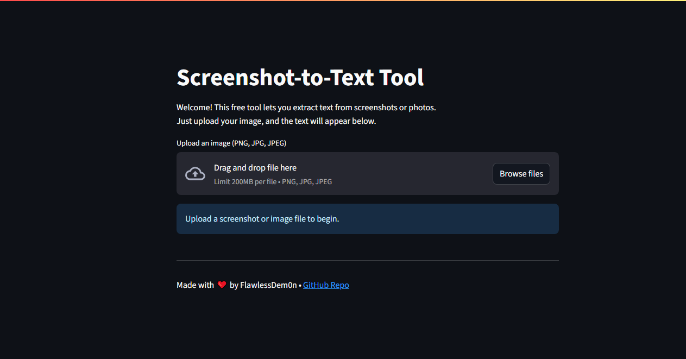
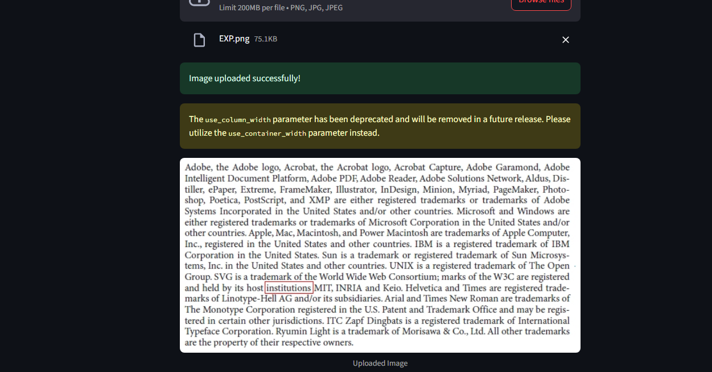
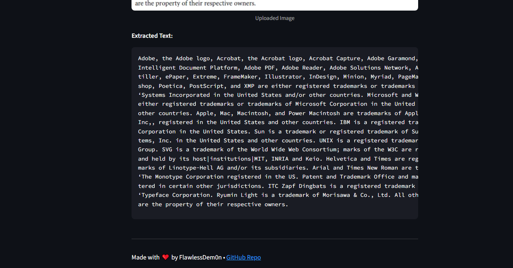

# Screenshot-to-Text Tool
 HEAD
**Screenshot-to-Text Tool** is a free, open-source Streamlit app for quickly extracting text from images or screenshots using the powerful [Tesseract OCR engine](https://github.com/tesseract-ocr/tesseract).  
Simply upload an image, and the app will extract the text and display it in an easy-to-copy format.

---

## ⚡ Features

- Extract text from screenshots, photos, scans, or documents
- Clean, user-friendly web interface (powered by Streamlit)
- 100% free and runs locally on your computer (no API or cloud fees)
- Supports PNG, JPG, and JPEG images

---

## 🚀 How to Use

### 1. **Install Tesseract OCR**

#### Windows:
- Download the Windows installer from [UB Mannheim’s Tesseract page](https://github.com/UB-Mannheim/tesseract/wiki).
- Run the installer and follow setup steps.
- By default, Tesseract is installed at:

# SS-to-Text
A free, open-source web app to quickly extract text from images or screenshots. Upload any image and get clean, copyable text in seconds. Private, fast, and easy to use. Perfect for students, professionals, or anyone who needs text from pictures.
 928da98e7d3d8a2d87433aeb8c06e687a09269a8

## Screenshots

### 1. App Welcome Screen

### 2. Image Uploaded

### 3. Extracted Text Result

