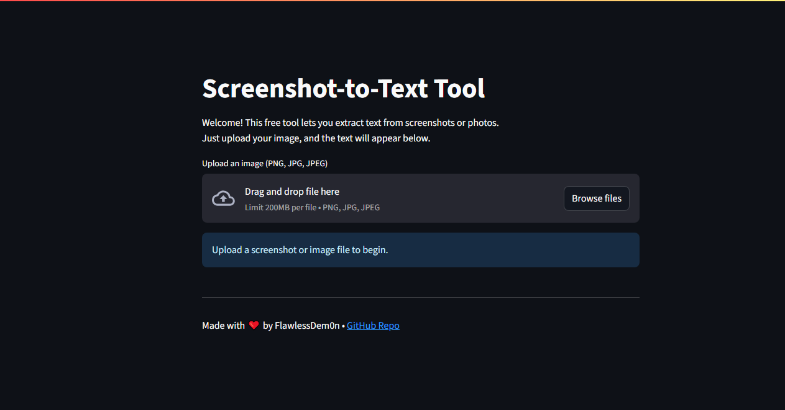
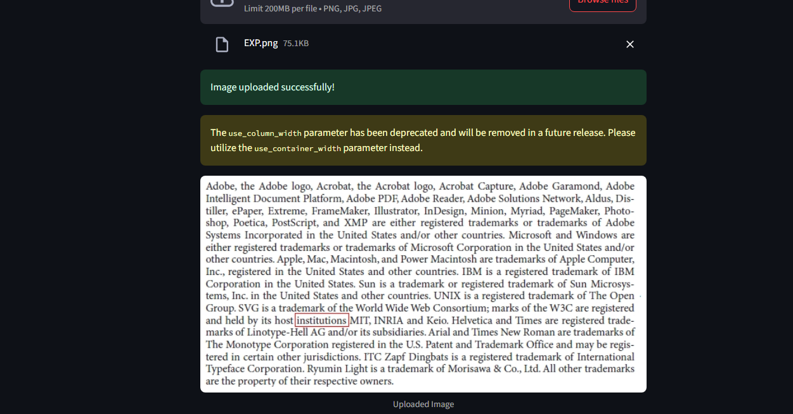
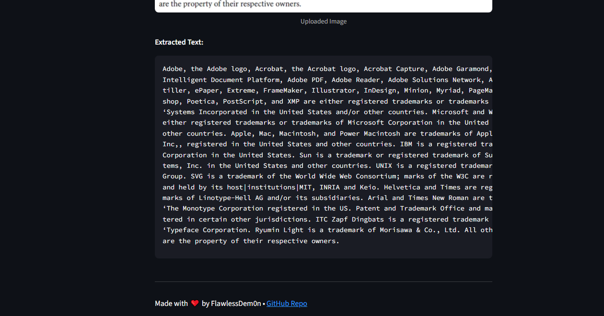

# Screenshot-to-Text Tool

A free, open-source Streamlit app for quickly extracting text from images or screenshots using the powerful [Tesseract OCR engine](https://github.com/tesseract-ocr/tesseract).

Simply upload an image, and the app will extract the text and display it in an easy-to-copy format.

---

## Table of Contents

- [Features](#features)
- [Quick Start](#quick-start)
- [Requirements](#requirements)
- [Screenshots](#screenshots)
- [License](#license)

---

## ⚡ Features

- Extract text from screenshots, photos, scans, or documents
- Clean, user-friendly web interface (powered by Streamlit)
- 100% free and runs locally on your computer (no API or cloud fees)
- Supports PNG, JPG, and JPEG images

---

## Quick Start

```bash
git clone https://github.com/FlawlessDem0n/SS-to-Text.git
cd SS-to-Text
pip install -r requirements.txt
streamlit run app.py
```

---

## Requirements

- **Python 3.7 or newer**
- [**Tesseract OCR**](https://github.com/UB-Mannheim/tesseract/wiki) (system install required)
- **Python packages:** streamlit, pillow, pytesseract

---

## Screenshots

### 1. App Welcome Screen


### 2. Image Uploaded


### 3. Extracted Text Result



---

## License

MIT License

---

*Built with ❤️ by *[*FlawlessDem0n*](https://github.com/FlawlessDem0n)

